# JMTarot

*Jodith Miftah Tarot* — a mobile-first tarot website, installable to the iPhone home
screen. Three reader personas, three services, the 22 Major Arcana. **Every reading is
written by a model at request time, in Indonesian or English, in the voice of whichever
reader you picked.**

**[www.jmtarot.site](https://www.jmtarot.site)** · v0.8.0 · Next.js 16 on Vercel `sin1`

```
pick a reader ──► pick a service ──► draw 3 of 22 ──► POST /api/reading
                                          │                   │
                          your question ──┤        moderation gate (glm-4.5-flash, 1.5s)
                                          │                   │
                    the cards that keep ──┤          glm-4.6, streamed, four paragraphs
                       coming back to you │                   │
                                          ▼                   ▼
                                    /history · /s/<slug> · the group chat
```

<p align="center">
  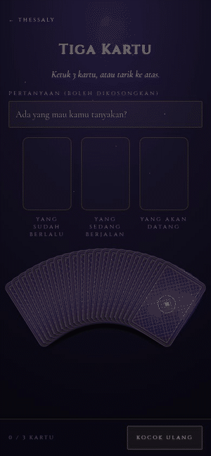
</p>

<p align="center"><em>A real draw against a real model: the question typed, three cards
taken from the fan, and the reading starting. Nothing here is a mockup.</em></p>

---

## Demo

Every capture below is the running app at **390 x 844** — an iPhone 12/13/14/15 width —
at 2x, driven over CDP against `npm run dev`, a real Postgres and real z.ai calls. The
readings, the chat turns and the translations were all generated at the moment of
capture; the reader portraits and the card art are the only pre-existing images.

<table>
<tr>
<td width="33%" align="center">
  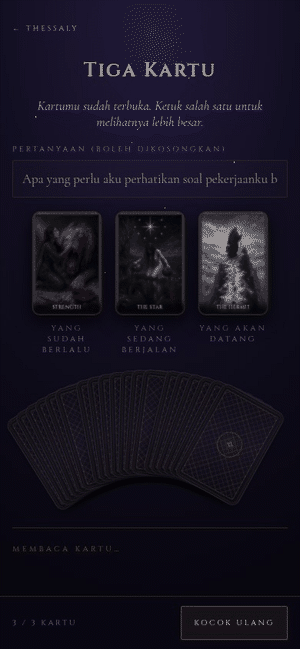
  <br><strong>A reading arrives</strong><br>
  <sub>Streamed, four paragraphs, real time.<br>The wait before the first word is<br>the model, not an animation.</sub>
</td>
<td width="33%" align="center">
  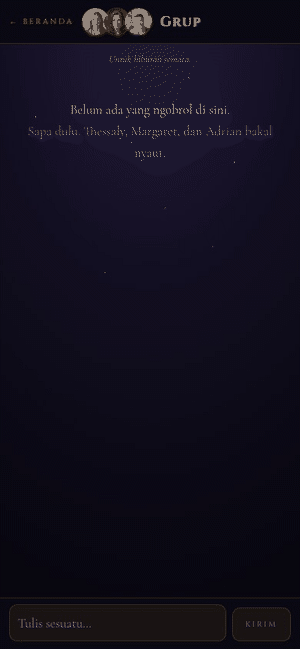
  <br><strong>Three readers, one room</strong><br>
  <sub>One message, one director, two<br>voices answering in their own.<br><em>2x speed — 34s in real time.</em></sub>
</td>
<td width="33%" align="center">
  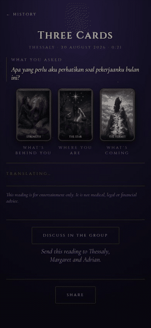
  <br><strong>EN translates, not regenerates</strong><br>
  <sub>The stored reading, put into English<br>and cached. <strong>The question stays<br>as it was typed</strong> — always.</sub>
</td>
</tr>
<tr>
<td width="33%" align="center">
  
  <br><strong>Who reads for you</strong><br>
  <sub>Above the three readers, the week's<br>recurring cards — <strong>written, never<br>counted out loud.</strong></sub>
</td>
<td width="33%" align="center">
  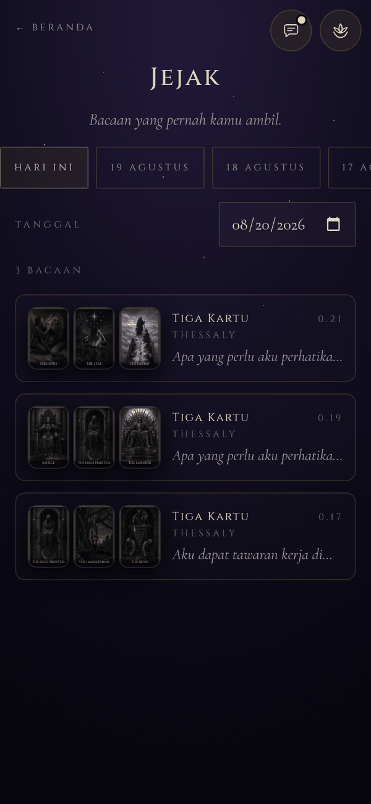
  <br><strong>Jejak</strong><br>
  <sub>Every reading you have taken,<br>by day. Blocked ones are absent<br>on purpose; failed ones are not.</sub>
</td>
<td width="33%" align="center">
  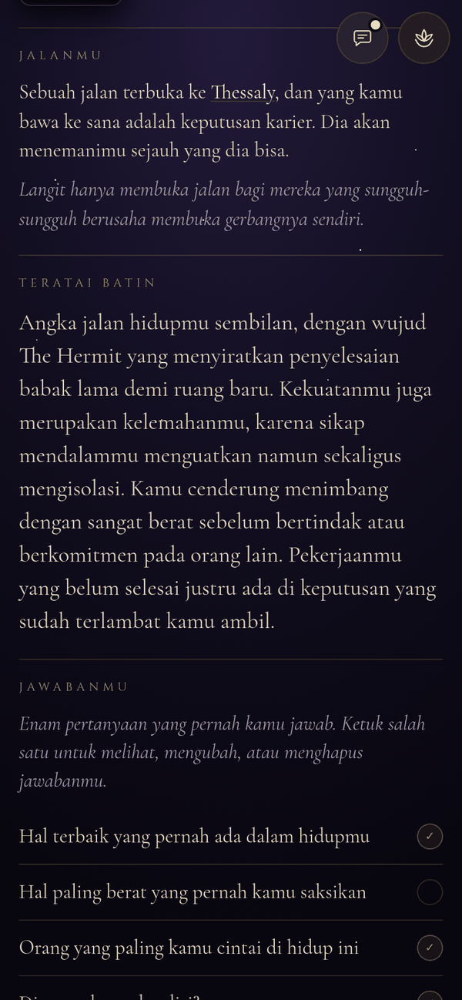
  <br><strong>A reading of the person</strong><br>
  <sub>Generated from the cards that keep<br>arriving — and the six answers,<br>readable one tap at a time.</sub>
</td>
</tr>
</table>

<details>
<summary>The rest of it: the landing page, the fan, the yes/no verdict, sharing, the public pages and the language switch</summary>

<p align="center">
  
  &nbsp;
  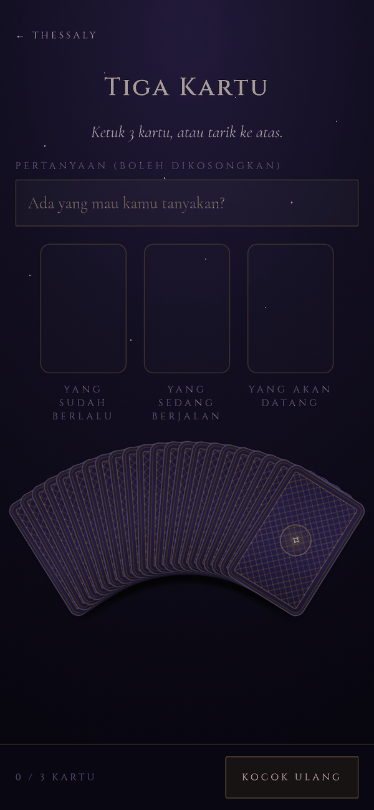
  &nbsp;
  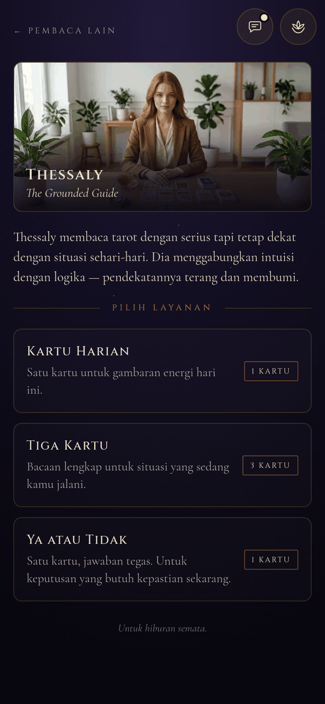
</p>

<p align="center">
  <em>Signed out, nobody has to log in to see what this is · the fan, 22 cards inside
  363px · one reader, three services</em>
</p>

<p align="center">
  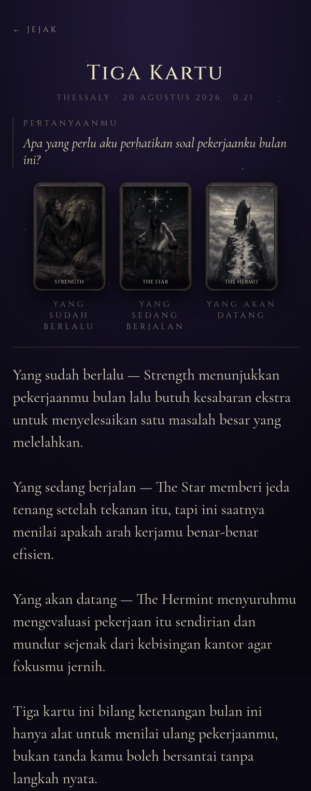
  &nbsp;
  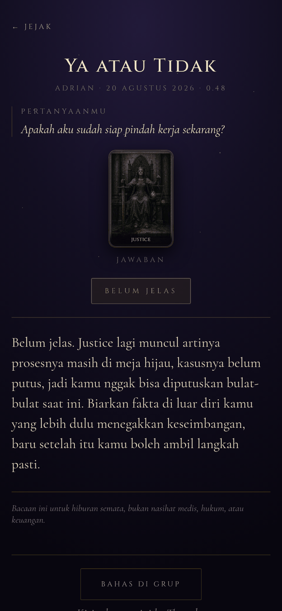
</p>

<p align="center">
  <em>A reading reconstructed exactly as it was drawn — read-only, by decision ·
  and <strong>the yes/no answer, derived in code</strong> rather than chosen by the
  model, reversal flip included</em>
</p>

<p align="center">
  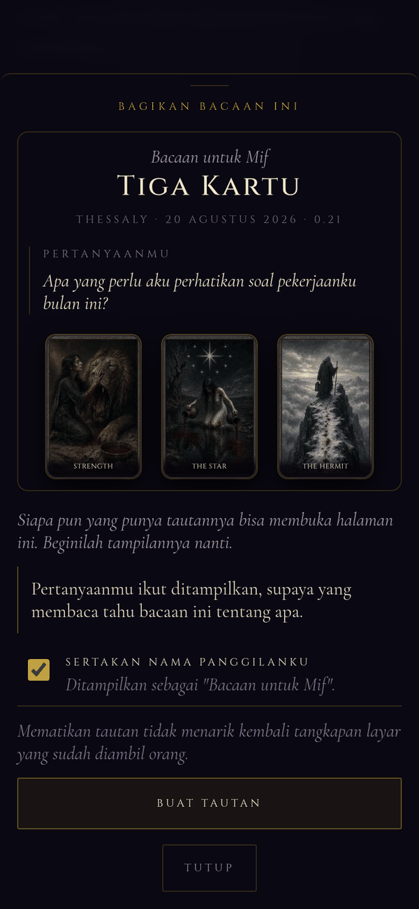
  &nbsp;
  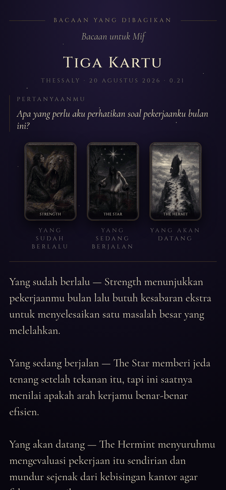
</p>

<p align="center">
  <em>The sheet shows the stranger's view by rendering it, not by describing it ·
  and this is that page, captured with the cookies cleared</em>
</p>

<p align="center">
  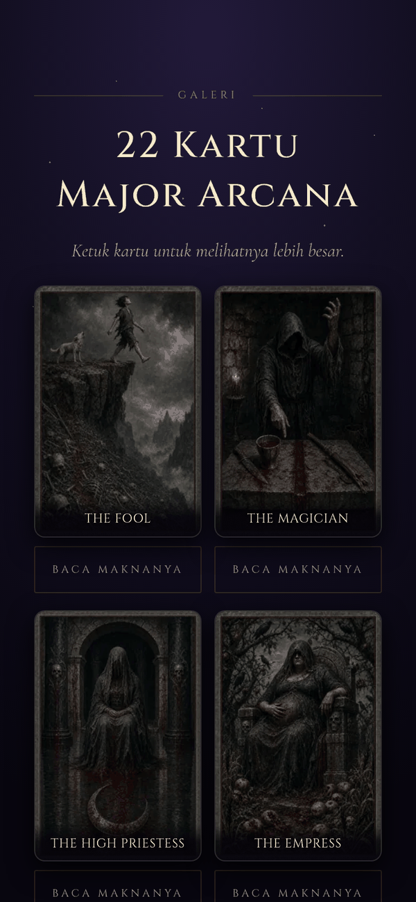
  &nbsp;
  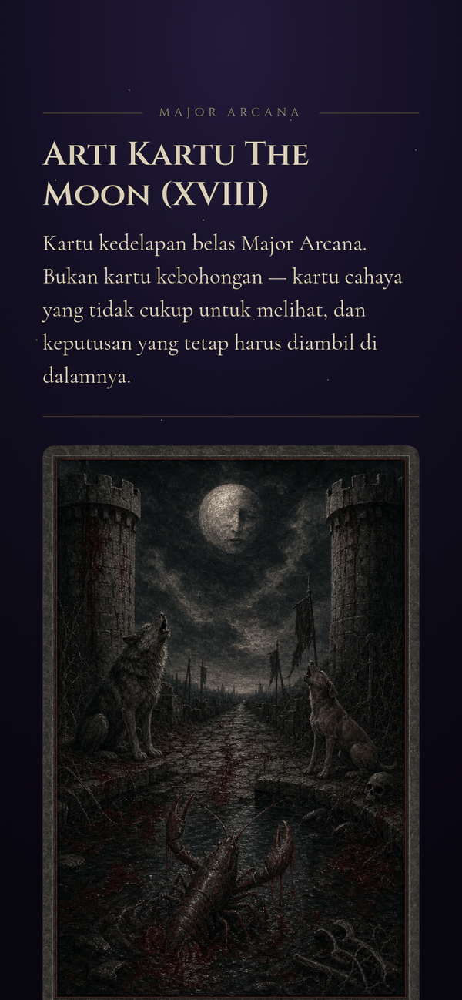
  &nbsp;
  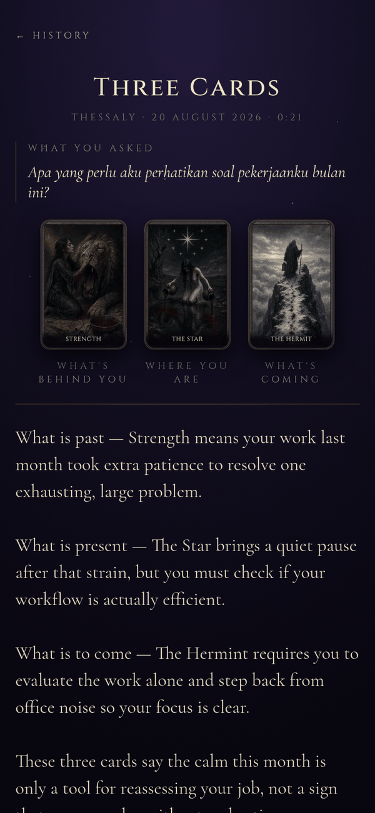
</p>

<p align="center">
  <em>54 indexable pages a search engine can actually reach · one of the 22 lore pages ·
  and the English half of the app</em>
</p>

<p align="center">
  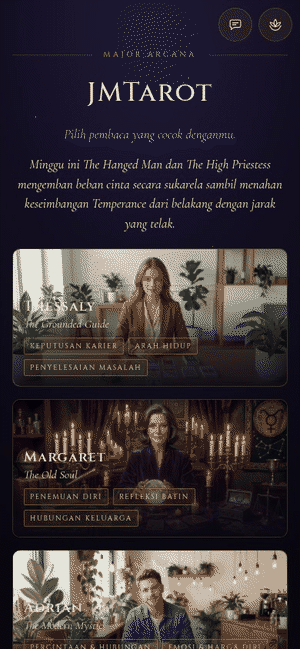
</p>

<p align="center"><em>The switch itself: the chrome flips at once, the generated prose
follows. Language lives in your profile and a cookie — never in the URL.</em></p>

</details>

---

## What it does

- **A reading, generated for you, now.** Pick Thessaly, Margaret or Adrian; pick a daily
  card, a three-card spread or a yes/no; type a question or leave it blank; draw from a
  fan of 22. The prose streams in that reader's voice, in your language, and is stored.
- **The answer is derived in code, not chosen by the model.** `effectiveYesNo()` decides
  yes / no / unclear from the card and its orientation — reversal flips it — and the
  prompt is handed the word. A question offering options (*"ayam atau ikan?"*) gets the
  same treatment from the other end: the model picks, and code validates the pick is
  **a slice of the question you typed**.
- **It remembers, and says so without doing arithmetic out loud.** A written verdict on
  the cards that keep arriving, a reading that refers back to your last one, and a
  per-day summary in your reader's voice. The model is never given a count — it gets two
  card names, a Shadow Arcana and a dominance word, so it cannot recite a tally it was
  never told.
- **Bilingual, interface and readings.** `id` and `en`. Switching does not regenerate
  anything: it **translates** the stored prose, checks the card names came through
  mechanically, and caches the result. Your question is never translated, on any surface.
- **A group chat that keeps going when nobody is looking.** All three readers and you in
  one room. A director writes a beat sheet, the voices execute it one turn at a time, and
  the readers can open a conversation unprompted. **Silence is a valid outcome** — there
  is no error bubble, because a friend who has nothing to add says nothing.
- **Onboarding once, then never asked again.** Nine screens, six free-text answers,
  AES-256-GCM encrypted at rest, distilled into a "Lotus" summary that grounds every
  later reading. A skipped answer stays skipped, and the readers never ask about the
  thing you declined to answer.
- **Sharing that a stranger can open.** `/s/<12 chars>` — no account, no indexing,
  revocable, and it carries the language it was shared in. Re-sharing rotates the slug
  *within* that language; revoking kills every language at once.
- **A public half, for people with no account.** A signed-out landing page, a gallery of
  all 22, a lore page per card, 44 wallpaper derivatives, and a blog with a markdown
  editor behind it. 54 indexable URLs across two language trees.
- **A moderation gate that refuses harm without refusing tarot.** Grief, illness, money
  trouble, divorce and a frightening partner are the subject matter — they are not
  refused. Eight categories where the answer itself would be the harm are, and the
  refusal is never delivered in a reader's voice.
- **An admin panel that measures and never restrains.** Thirteen panels, token cost per
  operation, a model-written finding under each chart, and per-user detail with counts
  and no text.

**Not built, deliberately:** birth card, the once-per-day card lock, an About page. Card
names stay English in both locales, and so do the readers'.

## The three readers

| | Voice | Specialities |
|---|---|---|
| **Thessaly** · The Grounded Guide | intuition plus logic, plain and lit | career decisions, direction, untangling a problem |
| **Margaret** · The Old Soul | long sentences, 1.3x everyone else's word budget | self-discovery, inner reflection, family |
| **Adrian** · The Modern Mystic | short, contractions, will make a joke | love, self-worth, short-term decisions |

Each carries a fixed `gender` in `readers.json` — Thessaly and Margaret female, Adrian
male — because a gender does not vary by locale but the *words* do. Each persona block in
the prompt carries one worked example paragraph, and **that paragraph does more work than
the description**: if the three ever stop being distinguishable with the names covered,
the fix is there and not in the code.

`npm run smoke -- --all` prints eighteen readings and ends with a blind read — three per
locale, names covered, key after forty blank lines. Guess. Three of three or the personas
need work.

## Stack

| Layer | Choice |
|---|---|
| Framework | Next.js 16.2 App Router, RSC, server actions, Node runtime everywhere |
| UI | React 19.2, **CSS Modules + a token file** — no Tailwind, no component library |
| Auth | Auth.js v5 (`next-auth@5.0.0-beta.32`), Google only, JWT sessions, no DB read per request |
| Database | Postgres 16 — Docker locally, **Neon (Singapore)** in production — Drizzle ORM, `postgres.js` |
| LLM | **glm-4.6** via z.ai's Anthropic-compatible endpoint, through `@anthropic-ai/sdk` |
| Limiter | Upstash Redis (Singapore), sliding window, fleet-wide and per-user |
| Validation | Zod 4 |
| Tests | Vitest 4 — **3,681 unit tests in 6.4s**, plus 659 integration tests against a real Postgres |
| Host | Vercel, region `sin1`, pinned in `vercel.json` |

**Thirteen runtime dependencies.** No CSS framework, no state library, no ORM code
generation at runtime, no Playwright — and the last one is a rule, not an accident (see
*Verifying it*).

> **On the model.** z.ai exposes an *Anthropic-compatible* endpoint, so `@anthropic-ai/sdk`
> with a `baseURL` override is the right client and there is no second SDK. `glm-4.6` writes
> the readings, `glm-4.5-flash` runs the moderation classifier (**a production requirement,
> not a cost optimisation** — on the reading model the gate becomes the latency), and
> `glm-5.2` runs the group chat and the admin-only calls. A second adapter for OpenAI-shaped
> providers is built, tested and *not switched on*; `gemini-3.5-flash-lite` is the documented
> emergency failover, on the paid tier, because the free tier trains on the prompt and every
> prompt here carries something a person typed.

## Getting started

Requires **Node 24**, Docker, a Google OAuth client and a z.ai key.

```sh
export PATH=~/tools/node-v24.18.0-linux-x64/bin:$PATH   # 20.11.1 is too old
npm install
cp .env.example .env.local     # then fill it in — .env.example is the reference
npm run db:up                  # Postgres 16 on 127.0.0.1:5432, plus Redis + SRH on 8079
npm run db:migrate             # apply the 16 committed migrations
npm run db:seed                # two dev users and two weeks of invented history
npm run dev                    # http://localhost:3001
```

**Port 3001, not 3000** — 3000 is permanently occupied here by another project, and an
OAuth redirect URI is an exact-match string, so `AUTH_URL=http://localhost:3001`.

`npm run db:seed` is what makes the history-dependent features visible while you work on
them: without it the frequency verdict, the day summary and the chained reading all have
nothing to read.

### Scripts

```sh
npm test                 # Vitest, unit only — no database, no Docker, ~6s
npm run typecheck        # tsc --noEmit
npm run build            # production build — RUN IT, a green typecheck is not enough
npm run test:integration # needs db:up; every test inside a rolled-back transaction

npm run smoke                    # one live call: are the key, base URL and model right?
npm run smoke -- --all           # eighteen readings: 2 locales x 3 readers x 3 services
npm run smoke -- --chat          # a scripted group chat, names covered — the release gate
npm run smoke -- --all --choice  # eighteen option-questions; the only instrument for the marker
npm run probe:usage              # four live calls: what does the provider report about tokens?
npm run probe:moderation         # the classifier's latency, from here — NOT from the lambda

npm run db:studio        # browse the rows
npm run db:down          # stop, keeping the volume
npm run db:nuke          # stop and throw the data away
```

**`npm run test:all` is the one red in this repo that means nothing.** Both Vitest
projects share one `serverless-redis-http` on 8079, so running them together fails a
shifting 12–22 of the limiter tests. Run them separately for a true answer.

### Environment

`.env.example` is the reference — every variable, its shape, its generation command and
its full annotation. Only the ones that bite are repeated here:

| Variable | The trap |
|---|---|
| `DATABASE_URL` | Neon's **pooled** string (`-pooler` in the host) — runtime only |
| `MIGRATE_DATABASE_URL` | Neon's **direct** string. Required on Vercel or the build **fails by design** |
| `UPSTASH_REDIS_REST_*` | Both or neither. **Without them every limit silently becomes per-instance** |
| `MODERATION_MODEL` | Unset falls back to the reading model and the gate becomes the latency |
| `LOTUS_STUB`, `PERSONA_STUB` | Never in production: every user silently gets the fallback template |
| `ANALYTICS_ENABLED`, `RATELIMIT_BACKEND` | **Default in opposite directions on purpose** — a typo must collect data, and a typo must not disable enforcement |
| `FIELD_ENCRYPTION_KEY` | Lose it and the encrypted answers read as "skipped", permanently. There is no re-encryption path |
| `TEST_DATABASE_URL` | A separate variable, never an override — the suite `TRUNCATE`s, and both the harness and the global setup refuse any name not ending `_test` |

**Escape every `$` as `\$` in `.env` files** — the loader expands `$VAR`, which silently
mangles a bcrypt hash and a database password alike. **Do not escape in the Vercel
dashboard**, where values are literal.

## Architecture

```
src/
  app/
    page.tsx            /  — signed out: a landing page; signed in: the reader picker
    [reader]/[service]/ the draw screen: fan, slots, flip, the streamed reading
    onboarding/         nine screens, asked exactly once
    history/            /history and /history/[id]
    account/            three editable facts, the persona, the six answers, delete
    chat/               the group room
    s/[slug]/           the public share page — no session, ever
    arcana/ gallery/ blog/   the public content surface
    admin/              thirteen panels, tokens, the markdown blog editor
    api/                35 route handlers: reading, translate, chat, memory, cron, …
  lib/
    llm/                two adapters, one interface, the meter and the ledger
    prompt/             three layers, each forked per locale behind a facade
    db/                 schema (22 tables), client, one query module per concern
    auth/               gate (pure) · config (edge-safe) · server (node-only)
    chat/               director, voices, beats, proactivity
    moderation/         blocklist, classifier, the gate
    i18n/               the catalogs and their fences
    memory/ persona/ share/ translate/ history/ analytics/ seo/ admin/
  components/           Fan, ReadingView, Chat*, the sheets
  content/              58 authored modules: 44 lore documents and the articles
  theme/                tokens.ts is the single source of truth; tokens.css mirrors it
tools/
  media/                the capture harness behind the images above
  e2e/                  a real Chrome driven over CDP, for production
  seo/                  width and crawl checks
```

### Routes

| Path | Auth | What |
|---|:--:|---|
| `/` | — | Signed out: a landing page Google's branding review needs. Signed in: the picker |
| `/[reader]` | ✅ | Bio and today's summary as two panels of one scroll-snap track |
| `/[reader]/[service]` | ✅ | The draw, and the reading |
| `/onboarding` | ✅ | Nine screens; `profiles.completed_at` is the only completion marker |
| `/history`, `/history/[id]` | ✅ | Your readings by day; one reconstructed exactly, read-only |
| `/account` | ✅ | The facts, the persona, the six answers, and the delete button |
| `/chat` | ✅ | Three readers and you |
| `/s/[slug]` | ❌ | A shared reading. `noindex`, `no-store`, `frame-ancestors 'self'` |
| `/gallery`, `/arcana/[slug]`, `/blog/[slug]` | ❌ | The indexable surface, also at `/en/…` |
| `/admin/**` | 🔑 | Operator only, by email allowlist |
| `POST /api/reading` | ✅ | Moderation gate, then a streamed reading, then one `after()` write |
| `POST /api/translate` | ✅ | Streams a translation; **204 is a real answer** |
| `POST /api/chat/*` | ✅ | `post`, `advance`, `state` — one beat per advance |
| `GET /api/cron/*` | 🔑 | The nudge that makes the room proactive, and the retention sweep |

**Locale is never a URL segment for the nine app routes, and always one for public
content.** Two languages cannot occupy one address in a search index, so `/gallery` is
Indonesian and `/en/gallery` is English — while inside the app `router.push('/en/...')`
is simply wrong and no `<Link>` is locale-aware. `/en/history` is not a route.

## The invariants

The ones that produce a working-looking app when they break. Each is enforced by a test
named for the failure, not for the function.

- **Never shuffle in a `useState` initialiser.** `shuffleDeck()` is impure, so it runs
  once on the server and again on the client; React cannot patch attribute mismatches
  during hydration, so **the querent sees one spread and is read a different one**, with
  nothing on screen looking wrong.
- **No side effects inside a `setState` updater.** StrictMode double-invokes them, so a
  tap that picked a card immediately un-picked it — the fan was dead in development and
  would have worked in production.
- **`local_date` is a `string`, not a `Date`.** It is the *querent's* calendar day, sent
  by the client; a `Date` renders in the server's zone and is a day out for anyone in
  Jakarta between midnight and 07:00.
- **Never log a driver error from a path that runs a query.** A Postgres error quotes the
  failing statement *and its bound parameters*, and one of those is the question someone
  typed. Production logs ids, attempt and SQLSTATE.
- **No free text in analytics props, ever.** `question.typed` carries a `length`. Event
  rows survive account erasure with `user_id` nulled, which is only honest because the
  sanitizer provably strips everything identifying.
- **The reading and the translation get no kill switch.** Five model-call features have
  one; these two are the backbone — a reading is the product and a translation is the bug
  the translation layer exists to prevent. A test asserts the absence *by name*, and
  asserts the set of model call sites is exactly its two tables, so a new one cannot ship
  unswitchable.
- **Every flag gates the model call, never the cached read.** Off means "write nothing
  new", never "hide what exists".
- **`ReadingView` never renders prose in a language the viewer did not ask for.** If a
  translation was not supplied it renders the translating state instead. That is the
  component's invariant rather than the caller's discipline, which is what stops the next
  caller shipping the bug by forgetting a prop.
- **The public share page never generates anything.** It is the one route with no session
  and no per-user budget, so a model call there is the whole fleet ceiling with no gate
  in front of it.
- **A committed migration nobody applied took production down while the app looked
  perfectly healthy.** One missing column made the sign-in upsert throw and bounced every
  querent to `/login` — while Google's consent screen succeeded every time. The build now
  applies migrations first and **fails rather than skipping**.

## Verifying it

Six loops, in increasing cost. **There is no Playwright and there must not be.**

1. **Vitest.** Deck maths, prompt assembly, the limiter, the gate's routing decision,
   field encryption, the query-module contract. 3,681 tests, 193 files, 6.4s, no database
   — and it must stay that way: it is the loop used a hundred times a day.
2. **Vitest integration.** 659 tests over anything touching `src/lib/db/**`, each inside
   an always-rolled-back transaction — ~100x faster than truncating twenty-two tables.
   Name the file `*.integration.test.ts` or the unit project picks it up and fails
   without a database.
3. **Screenshots via Windows Chrome** (`tools/shot.sh`) — kept only as a fallback.
4. **Fixed-width containers plus `getBoundingClientRect`. This is the loop for width.**
   Constrain the element, read `scrollWidth > clientWidth`, and measure overflow at
   320/360/390 with no viewport at all.
5. **A real Chrome in WSL, driven over CDP** (`tools/e2e/`). Real touch, DOM reads,
   requests with their POST bodies, and a persistent Google session — so a signed-in
   production flow can be exercised repeatedly. **The human authenticates and the harness
   never holds a credential:** no verb takes a password, and `whoami` prints the session
   cookie's length, never its value.
6. **A real iPhone against a preview URL.** Still the only way to check `100dvh`,
   safe-area insets, touch on glass, and Add to Home Screen.

Loop 5 answers *"does the UI agree with what it sends?"* — not *"does it fit a phone?"*.
For that, loop 4, or the media harness below.

### How the images in this README were captured

`tools/media/` is committed because the numbers in it were expensive. `run.sh launch`
starts a headless Chrome, `session` plants a real `dev-session` cookie, and a *scene* —
`tools/media/scenes/*.mjs` — drives one continuous CDP session while
`Page.startScreencast` records it. `gif.py` and `still.py` assemble the results; neither
needs ffmpeg, ImageMagick or gifsicle, none of which is installed here.

```sh
tools/media/run.sh launch --fresh          # prints the layout it actually got
tools/media/run.sh session miftah          # a genuine Auth.js JWE, localhost only
tools/media/run.sh scene tools/media/scenes/draw.mjs
python3 tools/media/gif.py /tmp/jmtarot-frames/draw docs/media/draw.gif --width 300
python3 tools/media/still.py docs/media/tmp-x.png docs/media/0x-x.png --width 600
```

Three things it had to learn, all measured rather than assumed:

- **`--window-size=390` gives a 500px layout, on Linux too.** Chrome will not make a
  browser window narrower than ~500px and `--headless=new` emulates a real window, so
  the screenshot is a 500px page cropped to look like a phone — the failure this repo
  had previously blamed on Windows. `Emulation.setDeviceMetricsOverride` is the
  mechanism that works, and it gives **exactly** 390. But it belongs to the CDP session
  that set it, so a driver whose every verb is its own connection has no override left
  by the time it captures anything.
- **A `captureScreenshot` loop silently eats taps.** With the loop running the fan
  reported `0 / 3 KARTU`; with it stopped, `1 / 3`. Typing landed either way. A
  screenshot forces a compositor frame and touch hit-testing needs the same compositor,
  so the recording came out as a GIF of somebody failing to use the app. A screencast is
  pushed by the browser and does not.
- **A navigation ends a screencast and drops the override.** One take spanning a `goto`
  kept 6 frames of 14 seconds; another produced 390px frames before the navigation and
  500px frames after, in one directory. So `rec` checks every frame's surface size,
  discards the ones that do not match, and reports how many — and `gif.py` refuses a
  directory of mixed sizes rather than scaling two layouts into one tidy GIF.

## Deployment

Vercel, from `main`. Pushing to `main` deploys production; every other branch gets a
preview URL. No workflow file.

**[`docs/DEPLOY-VERCEL.md`](docs/DEPLOY-VERCEL.md)** is the procedure.

Two things live in the repository rather than in a dashboard, on purpose:

- **`"regions": ["sin1"]` in `vercel.json`.** Without that key the whole app ran in
  Washington DC for the project's entire life — edge middleware in Singapore, every
  render in Virginia, Neon in `ap-southeast-1`, ~230ms per query each way on sequential
  round trips. A dashboard control is not a mechanism: a key in the repo ships with the
  code, is reviewable, survives a relink and overrides the dashboard. The one instrument
  is `curl -4 -sI <url> | grep x-vercel-id`, whose **second** segment is where the
  function ran. **Every latency figure predating 2026-08-19 was measured on the old
  stack.**
- **Migrations run inside `npm run build`,** before the build, and fail it rather than
  skip when they cannot run.

The domain is `www.jmtarot.site`; the apex 308-redirects to `www`, because an OAuth
redirect URI is a string comparison. **The Google consent screen is still in Testing
mode**, so only added test accounts can sign in — the public content pages are open to
anyone.

## iOS notes

The target is an iPhone. Three things carry most of the weight and all three fail
silently: `100dvh` rather than `100vh`, safe-area insets, and **Safari does not focus a
`<button>` when it is tapped** — so capturing `document.activeElement` on the way into a
dialog gets `<body>` on the one platform this app is built for, and restoring focus to
that "opener" drops the querent at the top of the document. Dialogs take the opener as a
prop instead.

**Signing in from the installed home-screen app is the bug worth knowing about.** iOS
seeds a home-screen app's cookie jar from Safari *at install time* and the two diverge
from then on, and it hands the `accounts.google.com` hop to a Safari overlay — so
Google's session lands in a jar the standalone shell can never see, through every retry.
Nothing moves a cookie between jars, because nothing can. The launch is answered with 256
opaque bits that exist only in the standalone jar; the overlay binds a `user_id` to a
one-shot `auth_handoffs` row keyed on their hash; the app claims it on **its own**
request, where a `Set-Cookie` lands in the app's jar by definition. Confirmed in
production 2026-08-09.

The acceptance test is one sentence, and no unit test stands in for it: install to the
home screen, sign in, come back, be signed in — then fully quit, relaunch, and still be
signed in.

## Assets

```
assets/major_arcanas/   72MB of source art. Never edited in place, never deleted
public/cards/           5.2MB of generated WebP, committed — 800x1200 and 240x360
public/wallpapers/      44 JPEGs, 23MB, committed. Its own cache header, not /cards/*'s
public/dukuns/          the three reader portraits
```

```sh
npm run assets              # source PNGs -> 800x1200 + 240x360 WebP
npm run wallpapers          # -> 44 derivatives, nothing upscaled and nothing cropped
npm run cards               # rebuild src/data/cards.json
python3 tools/make_icons.py # home-screen icons
```

All idempotent. `public/cards/` is committed so a deploy does not need Python, and it is
served with a one-year `immutable` header on **slug-based, non-content-hashed**
filenames — so regenerating the art means changing the filenames or shortening that
header first, or existing installs keep the old images.

The thumbnails exist because the fan paints all 22 cards at once. **The art is three
visually inconsistent generations**, measured in
[`docs/art-inconsistency.md`](docs/art-inconsistency.md) — the break is *luminance*, not
hue — and regenerating it for one consistent treatment is the highest-leverage
improvement left.

## Design provenance

The visual language comes from `Major Arcana Spread-Real Cards-Card Clickable.html`, a
Claude Design export kept in the repo as the reference. `src/theme/tokens.ts` is the
transcription — colours, Cinzel and Cormorant Garamond, motion curves — and
`tokens.css` mirrors it. New screens compose from those tokens rather than inventing
values.

The fan geometry was settled against `getBoundingClientRect` and the numbers are in the
header of `Fan.module.css`:

```
22 cards, 88x132, span 64deg, pivot 272px  ->  fan box 363 x 181
reveal 12.5px at the edges, 14.5px at the centre
```

375px (iPhone SE) is the binding constraint, and sweeping the span from 40° to 80° moves
the reveal only 13.6px → 15.3px — so **the span is a free aesthetic choice and the reveal
is set by screen width and card count.**

The regenerated deck carries **no text in the image at all**; `CardFace` draws the name
over the art at small sizes. Card names still stay English in both locales, and the
reason changed without the rule changing: a reading refers to The Moon, and a card
labelled anything else disagrees with the text underneath it. It is an explicit prompt
rule because the model tries to translate them and invents names like *"Pulan"*.

## Docs

| File | What it is |
|---|---|
| `CLAUDE.md` | The rules and the invariants. Loaded every session, so it binds rather than argues |
| `docs/workstream-notes.md` | The record: every trap that was paid for, how each bug was found, the live measurements |
| `docs/plans/2026-07-26-RECONCILIATION.md` | Outranks every plan. `schema.ts` is built from its §3 |
| `docs/plans/2026-07-25-jmtarot-web-rewrite.md` | Every decision and why, including the arbitrary-looking ones |
| `PUBLIC_RELEASE_ROADMAP_v0.7.0.md` | The group chat, seven workstreams |
| `docs/DEPLOY-VERCEL.md` | Vercel, DNS and Search Console, step by step |
| `docs/provider-comparison.md` | The measurements — **two of its own numbers were wrong**, and it says so |
| `docs/analytics-queries.md` | The queries an operator actually runs |

This was an Expo/React Native iOS app until 2026-07-25; the full tree is at commit
[`7fe0249`](../../tree/7fe0249) — an ancestor of `main`, so it stays reachable for ever
without a branch holding it open. The App Store costs $99/yr, a website costs nothing
and ships from Linux in one `git push`, and everything that mattered survived the move —
the readers, the deck, the Indonesian copy, the fan. One thing got better: with a server
in the loop, readings are generated instead of pre-written.

## Licence

Not yet chosen. The bundled fonts are Google Fonts under the SIL Open Font License.
